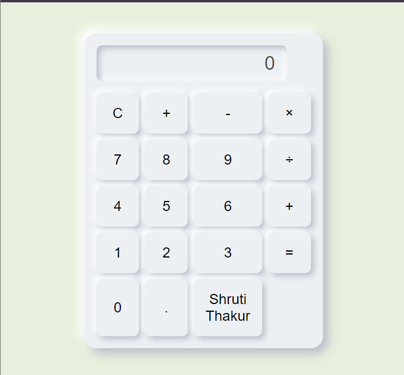

# 🌐 HTML, CSS, and JavaScript Playground

Welcome to the HTML, CSS, and JavaScript Playground! This repository is a space for experimenting with and learning various web development concepts through a collection of mini-projects. Each project focuses on a different aspect of web development, ranging from basic HTML structure to advanced JavaScript interactivity.

## Table of Contents
- [📖 Introduction](#introduction)
- [🛠️ Projects](#projects)
  - [🔢 Project 1: Calculator](#project-1-calculator)
  - [🔢 Project 2: Rock Paper & Scissors](#project-2-Rock-Paper-&Scissors)
 
## Introduction
This repository serves as a hands-on learning platform for web development enthusiasts. Whether you are a beginner or looking to sharpen your skills, these mini-projects will provide you with a comprehensive understanding of HTML, CSS, and JavaScript. Each project is designed to be self-contained, allowing you to explore specific concepts in isolation.

## Projects

### Project 1: Calculator

  
🔍 Preview

  <table>
    <tr>
      <td>
        
A simple calculator application built using HTML, CSS, and JavaScript. This project covers the basics of creating interactive web applications.

      </td>
      <td>
        
      </td>
    </tr>
  </table>

### Project 2: Rock Paper & Scissors

  
🔍 Preview

  <table>
    <tr>
      <td>
        
We explore game logic implementation for both player vs. player and player vs. system modes. Additionally, we understand how to handle user inputs, generate random numbers for 
            the system's moves, and dynamically update the game's outcome, enhancing our skills in creating interactive, user-friendly web applications.

      </td>
      <td>
        
      </td>
    </tr>
  </table>
